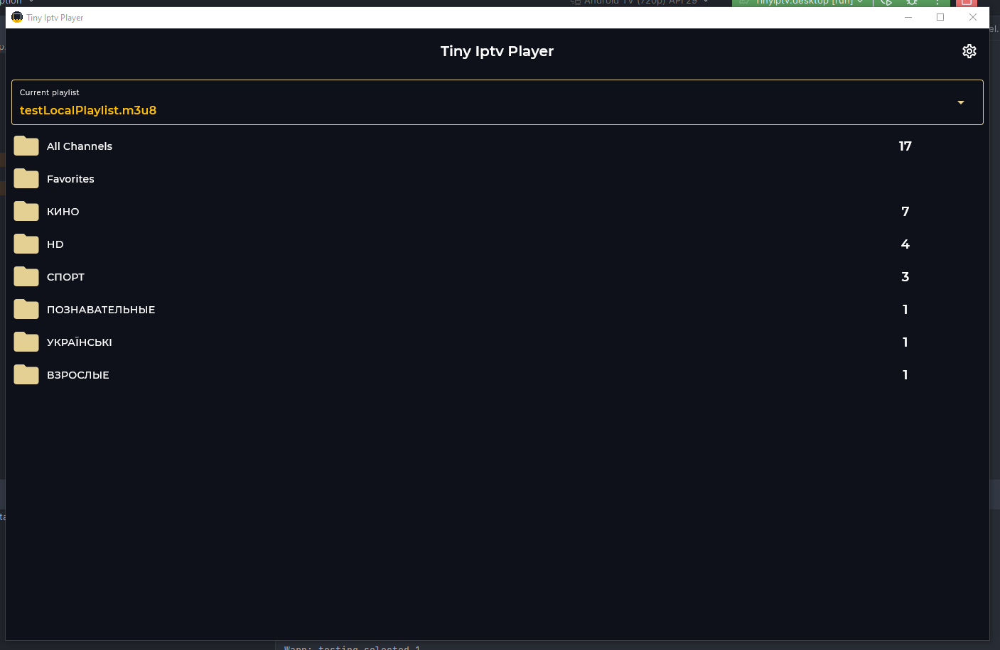
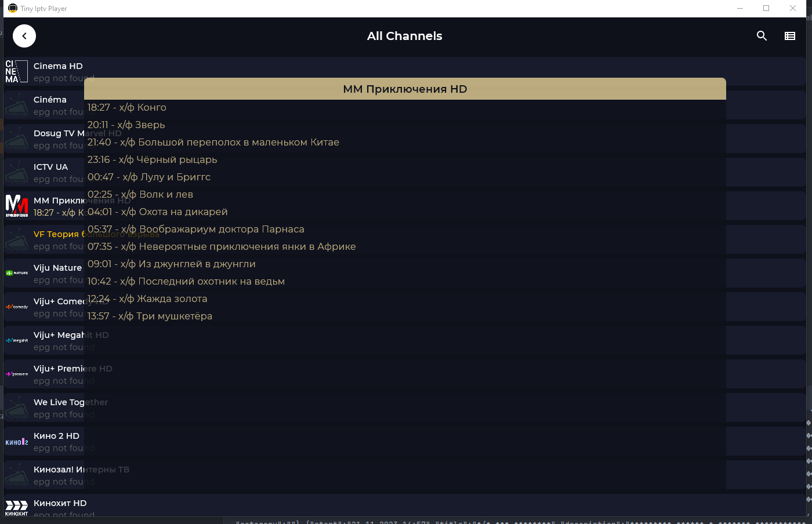
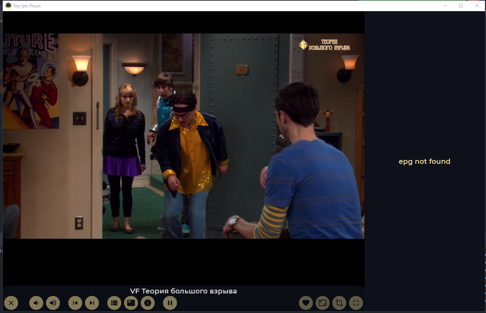
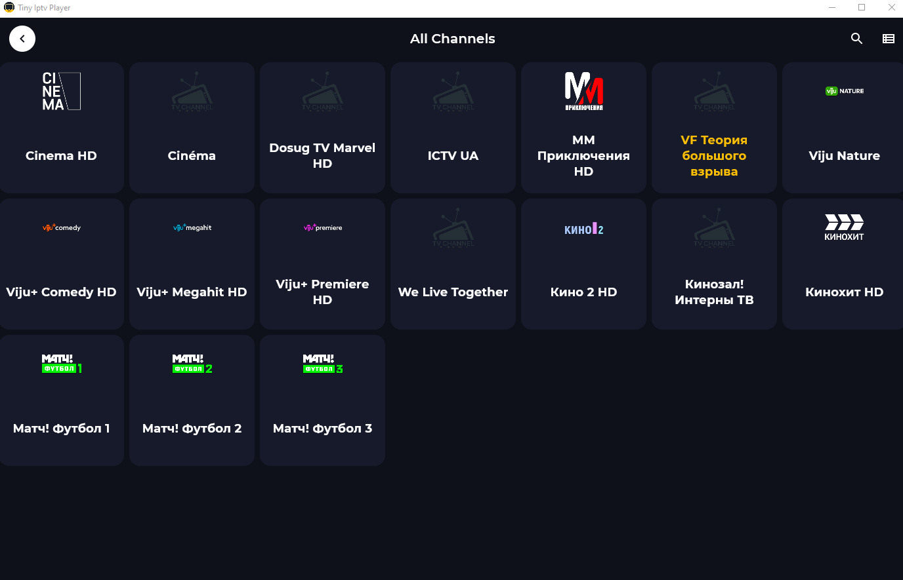

# Tiny Iptv Player KMP

The Iptv multiplatform video player, supporting m3u/m3u8 playlists, providing epg info for available
iptv
channels, support gestures for switching volume/channels, scheduling updates period
available on Android and Windows Desktop

## Features

* Support m3u/m3u8 playlists local and remote
* Epg provider
* Horizontal swipe to change current playing channels
* Vertical swipe to change volume
* Resize (Fit, Fill, Crop)
* Ratio (WideScreen, FullScreen, Cinematic)
* Scheduling updates for channels and epg
* Overlay for channel selection, epg and program info

## Common

### UI

#### [Jetpack Compose](https://developer.android.com/jetpack/compose)

Tiny Iptv Player is fully written with Compose, using AndroidView in some cases

### Networking

#### [Ktor](https://ktor.io/)

Tiny Iptv Player use for requests for playlist and epg data and parse responses

### Navigation

#### [PreCompose](https://github.com/Tlaster/PreCompose)

A multiplatform navigation library built for Compose

### Database

#### [SQLDelight](https://cashapp.github.io/sqldelight/2.0.0/)

SQLDelight generates typesafe kotlin APIs from your SQL statements. It verifies your schema,
statements, and migrations at compile-time and provides IDE features like autocomplete and
refactoring which make writing and maintaining SQL simple.

### DI

#### [Koin](https://insert-koin.io/)

The pragmatic Kotlin & Kotlin Multiplatform Dependency Injection framework

### Image

#### [Kamel](https://github.com/Kamel-Media/Kamel)

Asynchronous media loading library, it provides a simple, customizable and efficient way to load,
cache, decode and display images in your application

### Resources

#### [Libres](https://github.com/Skeptick/libres)

Resources generation in Kotlin Multiplatform

### Theming

#### [Material 3 Theming](https://m3.material.io/develop/android/mdc-android)

Tiny Iptv Kmp is using brand new Material 3.
[Material Theme builder](https://material-foundation.github.io/material-theme-builder/#/custom) is
used to create material 3 theme and directly export it for Compose.

## Android

Player based on [Media3](https://github.com/androidx/media)
It uses ExoPlayer's ``ffmpeg`` extension
with [all its audio formats](https://exoplayer.dev/supported-formats.html#ffmpeg-extension)
enabled (it can handle even special formats like AC3, EAC3, DTS, DTS HD, TrueHD etc.).

## Screenshots

## Desktop (Windows)

Player based on [Vlc](https://github.com/caprica/vlcj)
port for java

using [Calf File Picker](https://github.com/MohamedRejeb/Calf)
for local file selection

some features currently not work proper:

- [X] Horizontal swipe to change current playing channels
- [X] Vertical swipe to change volume
- [ ] Resize (Fit, Fill, Crop)
- [ ] Ratio (WideScreen, FullScreen, Cinematic)
- [X] Overlay for channel selection
- [X] Overlay for epg for channel
- [X] Overlay for current program info

